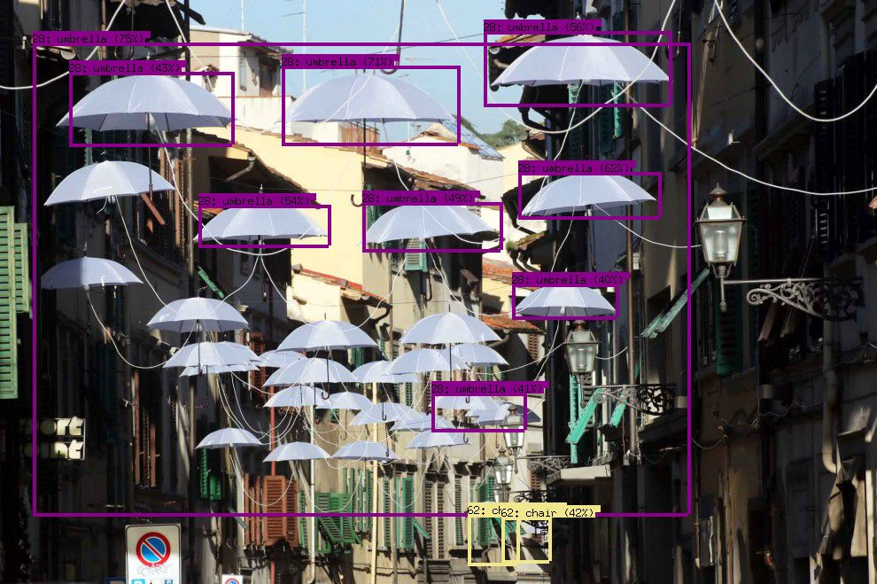

# Machine Learning with Go

A short tour through ML libraries in Go, [golab 2018](https://www.golab.io/).

About ten self-contained examples.

* Slides as [markdown](Slides.md) or [PDF](Slides.pdf)

----

Overview

* (1) data acquisition and preparation (csv, xml, json, dataframe)
* (2) linear regression example (regression)
* (3) naive bayes spam classifier (bayesian)
* (4) logistic regression (goml)
* (5) a decision tree classifier (golearn)
* (6) k-nearest neighbors (golearn)
* (7) a simple neural network (gophernet, gonum)
* (8) pre-trained model (tensorflow/go)

----

Note: This is an ongoing exploration and there are a few interesting libraries
that I intend to include in the future:

* [tfgo](https://github.com/galeone/tfgo), which solves a few issues with tensorflow
* [gorgonia](https://github.com/gorgonia/gorgonia), a generic machine learning
  library, which has been used for an AlphaZero
[implementation](https://github.com/gorgonia/agogo).

----

The initial version of the workshop traded overview for interactivity, which
made it less interesting as it could have been.

----

> Ombrelli bianchi sospesi in aria tra i palazzi di via Romana, a Firenze (Foto
Cge Fotogiornalismo),
([Source](https://firenze.repubblica.it/cronaca/2013/12/04/foto/gli_ombrelli_sospesi_di_via_romana-72688861/1/#1)).
