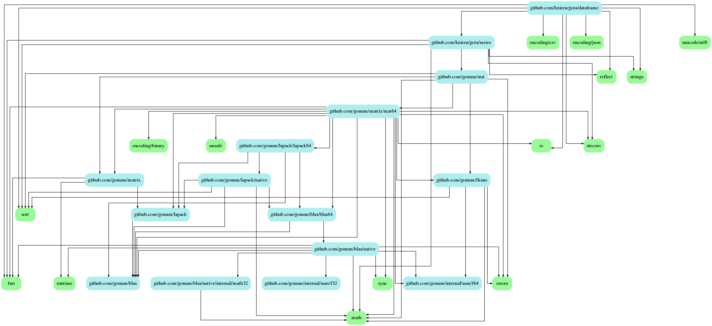
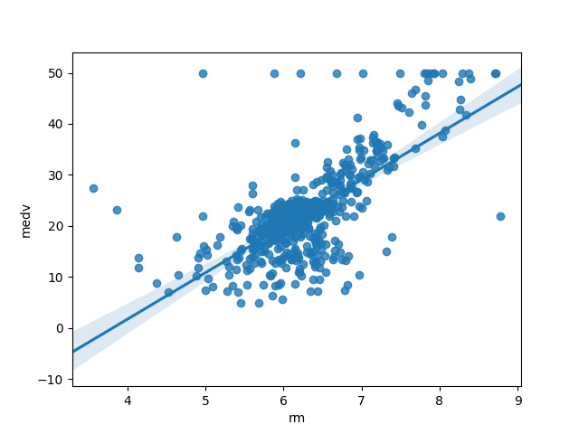
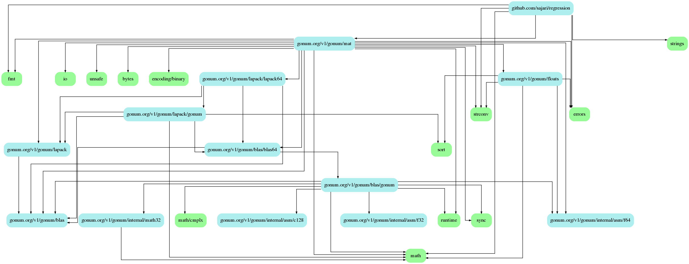
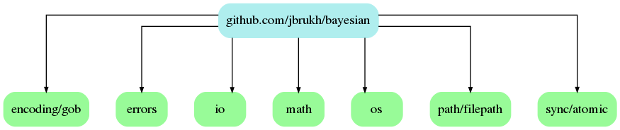
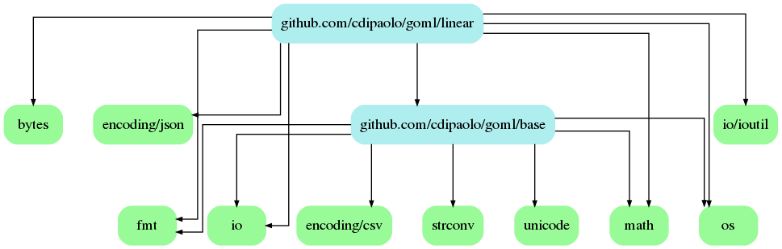
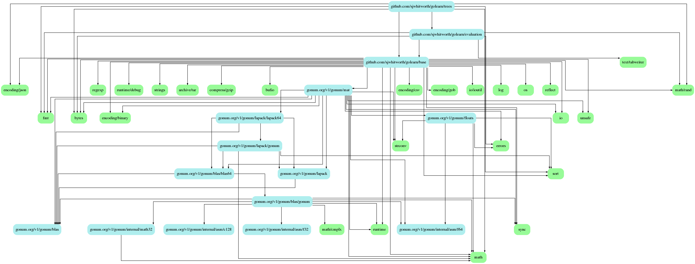
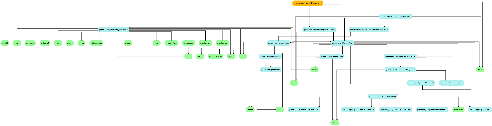
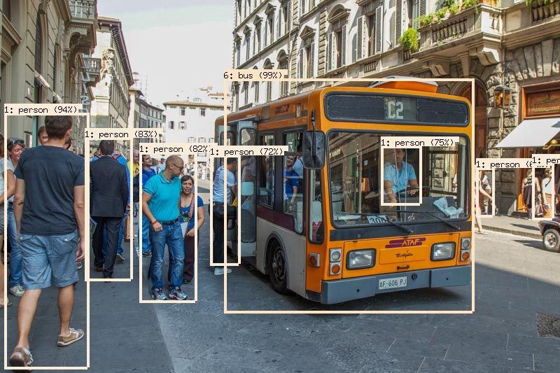

# Learning from data with Go

A short tour through ML topics in Golang.

Golab 2018-10-23, 10:30--12:00, Florence (IT)

[Martin Czygan](mailto:martin.czygan@gmail.com), [github.com/miku](http://github.com/miku)

----

# About me

* Software developer at Leipzig University Library
* Maintainer of a few (Go) tools (metha, solrbulk, zek, ...)

----

# About this workshop

* At [Golab 2017](https://www.golab.io/2017-edition.html) I was curious about
  the applications of the [io interfaces](https://github.com/miku/exploreio).
* Lots of ML resources available in Python, but how about Go?
* Which libraries? Examples?

----

# Disclaimer

* I am not an ML researcher, just a curious software developer.
* This is an ongoing exploration, this workshop is a snapshot.
* Less about theory, more about Go implementations.

----

# Resources

* [ML with Go](https://www.packtpub.com/big-data-and-business-intelligence/machine-learning-go)
* [ML on Code](https://www.youtube.com/watch?v=Lt3qZAwQX3w)
* [Awesome Machine Learning On Source Code](https://github.com/src-d/awesome-machine-learning-on-source-code)

----

# Challenges

What ingredients do we need for an ML project?

* data availability, acquisition, harvesting
* inspection, cleaning, grouping, analysis
* learning
* deployment

<!-- Most of my current work is centered around making data available. -->

----

# Overview

As of October 2018, [awesome-go](https://github.com/avelino/awesome-go#machine-learning) lists 29 projects in the ML category. We will look at a subset:

* kniren/gota, sajari/regression, jbrukh/bayesian, sjwhitworth/golearn, tensorflow/go

----

# Overview

Options:

* write an ML algorithm in pure Go
* use an existing ML library
* reuse models created with other tools

----

# Overview

* (1) data acquisition and preparation (csv, xml, json, dataframe)
* (2) linear regression example (regression)
* (3) naive bayes spam classifier (bayesian)
* (4) logistic regression (goml)
* (5) a decision tree classifier (golearn)
* (6) k-nearest neighbors (golearn)
* (7) a simple neural network (gophernet, gonum)
* (8) pre-trained model (tensorflow/go)

----

# Examples

There are examples in the `examples` directory. Some require additional files:

* http://storage.googleapis.com/download.tensorflow.org/models/inception5h.zip (pretrained)
* http://download.tensorflow.org/models/object_detection/ssd_mobilenet_v1_coco_11_06_2017.tar.gz (coco)

----

# (1) Data preparation

* Go seems very practical for data acquisition tasks: crawlers, harvesters:
  Parallel, easy to deploy, light on resources.

----

# (1) Data preparation

* Go is less interactive than other languages, which makes other languages more attractive.

But there are options:

* [gomacro](https://github.com/cosmos72/gomacro), an almost complete Go interpreter with a REPL
* [gophernotes](https://github.com/gopherdata/gophernotes), built on gomacro, one of the (4) Go [jupyter kernels](https://github.com/jupyter/jupyter/wiki/Jupyter kernels)

----

# (1) Data preparation

* loading and slicing a CSV file with `encoding/csv`

```go
    r := csv.NewReader(os.Stdin)
    for {
        record, _ := r.Read()
        fmt.Println(record)
    }
````
----

# (1) Data preparation

You can write your own struct deserializer for CSV, e.g. via
[fatih/structs](https://github.com/fatih/structs).

```go
type Record struct {
        Name  string `csv:"name"`
        Plate string `csv:"plate"`
}
```

* see: example/csvstruct

----

# (1) Data preparation

There is good support for JSON and XML in the standard library.

* decode, encode
* unmarshal, marshal

Mapping controlled via [struct tags](https://github.com/golang/go/wiki/Well-known-struct-tags).


----

# (1) Data preparation

Utilities to generate structs from raw JSON or XML data, e.g.

* [JSONGen](https://github.com/bemasher/JSONGen)
* [XMLGen](https://github.com/dutchcoders/XMLGen)
* [zek](https://github.com/miku/zek)

----

# (1) Data preparation

```go
$ curl -s http://api.crossref.org/works/10.2307/529820 \
    jq .message.author[] | JSONGen | head

type _ struct {
        Affiliation []interface{} `json:"affiliation"`
        Family      string        `json:"family"`
        Given       string        `json:"given"`
        Sequence    string        `json:"sequence"`
}
```

----

# (1) Data preparation

```go
 $ curl -sL https://git.io/fxK2j | zek -c -e | head
// Rss was generated 2018-10-21 15:38:03 by tir on sol.
type Rss struct {
        XMLName xml.Name `xml:"rss"`
        Text    string   `xml:",chardata"`
        Rdf     string   `xml:"rdf,attr"`
        Dc      string   `xml:"dc,attr"`
        Geoscan string   `xml:"geoscan,attr"`
        Media   string   `xml:"media,attr"`
        Gml     string   `xml:"gml,attr"`
        Taxo    string   `xml:"taxo,attr"`
        ...
```

----

# (1) Data preparation

* Loading and preparing CSV by hand is tedious
* DataFrame like abstraction provided by [gota](https://github.com/kniren/gota)

Two main subpackages:

* [series](https://github.com/kniren/gota/series)
* [dataframe](https://github.com/kniren/gota/dataframe)

```
$ go get github.com/kniren/gota/...
```

----

# (1) Data preparation



----

# (1) Data preparation

```go
nvs := []string{"NA", "NaN", "<nil>"}
df := dataframe.ReadCSV(os.Stdin,
        dataframe.DefaultType(series.String),
        dataframe.DetectTypes(true),
        dataframe.HasHeader(false),
        dataframe.Names("sl", "sw", "pl", "pw", "species"),
        dataframe.NaNValues(nvs))

fmt.Println(df)
```

----

# (1) Data preparation

```go
[150x5] DataFrame

    sl       sw       pl       pw       species
 0: 5.100000 3.500000 1.400000 0.200000 Iris-setosa
 1: 4.900000 3.000000 1.400000 0.200000 Iris-setosa
 2: 4.700000 3.200000 1.300000 0.200000 Iris-setosa
 3: 4.600000 3.100000 1.500000 0.200000 Iris-setosa
 4: 5.000000 3.600000 1.400000 0.200000 Iris-setosa
 5: 5.400000 3.900000 1.700000 0.400000 Iris-setosa
 6: 4.600000 3.400000 1.400000 0.300000 Iris-setosa
 7: 5.000000 3.400000 1.500000 0.200000 Iris-setosa
 8: 4.400000 2.900000 1.400000 0.200000 Iris-setosa
 9: 4.900000 3.100000 1.500000 0.100000 Iris-setosa
    ...      ...      ...      ...      ...
    <float>  <float>  <float>  <float>  <string>
```

----

# (1) Data preparation

Basic stats with gota via `df.Describe()`:

```go
    column   sl       sw       pl       pw       species
 0: mean     5.843333 3.054000 3.758667 1.198667 -
 1: stddev   0.828066 0.433594 1.764420 0.763161 -
 2: min      4.300000 2.000000 1.000000 0.100000 Iris-s..
 3: 25%      5.100000 2.800000 1.600000 0.300000 -
 4: 50%      5.800000 3.000000 4.300000 1.300000 -
 5: 75%      6.400000 3.300000 5.100000 1.800000 -
 6: max      7.900000 4.400000 6.900000 2.500000 Iris-v..
    <string> <float>  <float>  <float>  <float>  <string>
```

----

# (1) Data preparation

Filtering in Gota.

```go
mean := func(s series.Series) series.Series {
        floats := s.Float()
        sum := 0.0
        for _, f := range floats {
                sum += f
        }
        return series.Floats(sum / float64(len(floats)))
}

// Apply, will not err on non-numeric columns.
cmean := df.Capply(mean)
rmean := df.Select([]string{"sl", "sw"}).Rapply(mean)
```

----

# (1) Data preparation

Gota highlights:

* supports reading from maps, JSON
* join data
* chaining API

More to write than Python but type-saver. Plotting not as integrated as with Pandas `df.plot()`.

----

# (2) Linear Regression

> In statistics, linear regression is a linear approach to modelling the
> relationship between a scalar response (or dependent variable) and one or
> more explanatory variables (or independent variables).


----

# (2) Linear Regression

Using the boston house prices dataset.

* 506 instances, 13 features

> The Boston house-price data of Harrison, D. and Rubinfeld, D.L. 'Hedonic
> prices and the demand for clean air', J. Environ. Economics & Management,
> vol.5, 81-102, 1978.   Used in Belsley, Kuh & Welsch, 'Regression diagnostics
> ...', Wiley, 1980.   N.B. Various transformations are used in the table on
> pages 244-261 of the latter.

----

# (2) Linear Regression



----

# (2) Linear Regression

* see: example/linrego

```shell
$ go get github.com/sajari/regression
```

----

# (2) Linear Regression

* [sajari/regression](https://github.com/sajari/regression), Go 1.8 or later



----

# (2) Linear Regression

Set features and dependent variables.

```go
r := new(regression.Regression)
r.SetObserved("Price")
r.Var("...")
```

Add data points.

```go
r.Train(regression.DataPoint{...})
```

----

# (2) Linear Regression

Loading the data set.

```go
f, err := os.Open("BostonHousing.csv")
if err != nil {
    log.Fatal(err)
}
defer f.Close()

df := dataframe.ReadCSV(f)
if df.Err != nil {
    log.Fatal(df.Err)
}
```

----

# (2) Linear Regression

Setup problem.

```go
// Get float values per column.
regressand := df.Col("medv").Float()

// Prepare model.
r := new(regression.Regression)
r.SetObserved("medv")
r.SetVar(0, "crim")
r.SetVar(1, "zn")
r.SetVar(2, "indus")
```

----

# (2) Linear Regression

Add data points.

```go
// Add data points.
for i, regr := range regressand {
    features := make([]float64, 13)
    for j := 0; j < 13; j++ {
        features[j] = df.Elem(i, j).Float()
    }
    r.Train(regression.DataPoint(regr, features))
}

r.Run()
```

----

# (2) Linear Regression

```go
// Results.
fmt.Printf("Regression formula: %v\n", r.Formula)
```

> Predicted = 36.46 + crim*-0.11 + zn*0.05 + indus*0.02 + chas*2.69 +
> nox*-17.77 + rm*3.81 + age*0.00 + dis*-1.48 + rad*0.31 + tax*-0.01 +
> ptratio*-0.95 + b*0.01 + lstat*-0.52

----

# (2) Linear Regression

* coefficient of (multiple) determination

> which provides an estimate of the strength of the relationship between model
> and the response variable

```go
r.R2 // R2: 0.7406426641094076
```

----

# (2) Linear Regression

* Access coefficients with `r.Coeff`
* Predict via `r.Predict`

----

# (2) Linear Regression

* Not too much code, relatively elegant API.
* Lot of code compared to `df.plot`, `seaborn.pairplot` or `seaborn.regplot`.

----

# (3) Spam Classifier

* classic supervised problem
* given classes of text (e.g. spam, not-spam), learn a model separate the two
* naive bayes classifier

* see: examples/spam

----

# (3) Spam Classifier

* assume vocabulary differs between classes
* assume (naively) words appear independent from each other in text (similar to
  bag of words)
* estimate the *spaminess* by calculating word frequencies of either class (of message)

# (3) Spam Classifier

Given a `spam.csv` file.

```shell
$ head spam.csv
v1,v2,,,
ham,"Go until jurong point, crazy.. A.....
ham,Ok lar... Joking wif u oni...,,, .....
spam,Free entry in 2 a wkly comp to w.....
ham,U dun say so early hor... U c alr.....
ham,"Nah I don't think he goes to usf.....
```


----

# (3) Spam Classifier

* package: [github.com/jbrukh/bayesian](https://github.com/jbrukh/bayesian)



----

# (3) Spam Classifier

```shell
$ go get github.com/jbrukh/bayesian
```

----

# (3) Spam Classifier

The API of [bayesian](https://github.com/jbrukh/bayesian) is quite simple:

```go
...
classifier := bayesian.NewClassifier("ham", "spam")
...
classifier.Learn(ham, "ham")   // []string
classifier.Learn(spam, "spam") // []string
...

// Given an example as []string
scores, likely, _ := classifier.LogScores(example)
```

----

# (3) Spam Classifier

Additionally we need to

* read the file
* split the dataset into training and test sets
* tokenize (and normalize)
* calculate the accuracy

----

# (3) Spam Classifier

Handling data.

```go
// Example groups a string with a class.
type Example struct {
        Value string
        Class string
}

// Dataset for spam.
type Dataset struct {
        Examples []Example
}
```

----

# (3) Spam Classifier

* Train, test split (would benefit from generics)

```go
func (ds *Dataset) TrainTestSplit(trainingPct float64) (
    train *Dataset, test *Dataset) {
    ...
}
```

----

# (3) Spam Classifier

* Tokenization, lots of room for adjustments.

```go
// Return the tokens for a single example
// to use for train and test inputs.
tokenize := func(example Example) (result []string) {
        for _, t := range strings.Fields(example.Value) {
                t := strings.ToLower(t)
                result = append(result, token)
        }
        return
}
```

----

# (3) Spam Classifier

```go
tp, tn, fp, fn := 0, 0, 0, 0
for _, ex := range test.Examples {
        _, likely, _ := classifier.LogScores(tokenize(ex))
        switch {
        case likely == 0 && ex.Class == "ham":
                tp++
        case likely == 0 && ex.Class == "spam":
                fp++
        case likely == 1 && ex.Class == "spam":
                tn++
        case likely == 1 && ex.Class == "ham":
                fn++
        }
}
// Accuracy = TP + TN / TP + FP + FN + TN
testAccuracy := float64(tp+tn) / float64(tp+tn+fp+fn)
```

----

# (3) Spam Classifier

```shell
$ go run main.go hello world < spam.csv
2018/10/21 20:20:53 samples train=4404, test=1169
2018/10/21 20:20:53 accuracy=0.98
2018/10/21 20:20:53 [-16.462658579 -19.993521215] 0
ham: hello world
```

```shell
$ go run main.go hello contract < spam.csv
2018/10/21 20:20:26 samples train=4404, test=1169
2018/10/21 20:20:26 accuracy=0.98
2018/10/21 20:20:26 [-19.407097558 -18.894908926] 1
spam: hello contract
```

----

# (3) Spam Classifier

* simple model (no hyperparameter tuning)
* applications in document classification
* works with smaller datasets
* preprocessing accounts for most code (in this case)

----

# (4) Logistic Regression

* (binary) classification model
* linear combination of features to predict class
* logistic function

* see: examples/logreg.go

```
$ go get github.com/cdipaolo/goml/...
```

----

# (4) Logistic Regression


----

# (4) Logistic Regression

* implemented in [https://github.com/cdipaolo/goml](https://github.com/cdipaolo/goml/tree/master/linear)



----

# (4) Logistic Regression

* goml

> The library includes comprehensive tests, extensive documentation, and clean,
> expressive, modular source code.

----

# (4) Logistic Regression

* loading data

```
// LoadDataFromCSV takes in a path to a CSV file and
// loads that data into a Golang 2D array of 'X' values
// and a Golang 1D array of 'Y', or expected result,
// values.
//
// Errors are returned if there are any problems
//
// Expected Data Format:
// - There should be no header/text lines.
// - The 'Y' (expected value) line should be the last
//     column of the CSV.

base.LoadDataFromCSV("train.csv")
```

----

# (4) Logistic Regression

Confusion matrix for classification.

```go
// ConfusionMatrix allows to calculate
// accuracy and other metrics.
type ConfusionMatrix struct {
	truePositive  int
	trueNegative  int
	falsePositive int
	falseNegative int
}
```

----

# (4) Logistic Regression

A simple, manual grid search.

```go
// BestVersion keeps model and metrics grouped.
type BestVersion struct {
	ConfusionMatrix *ConfusionMatrix
	Boundary        float64
	Model           *linear.Logistic
	Iteration       int // How many iterations.
}
```

----

# (4) Logistic Regression

```go
for ... {
    cm, model, err := learnModel(parameters)
    ...
    if cm.Accuracy() > best.Accuracy() {
        best = BestVersion{...}
    }
}
```

----

# (4) Logistic Regression

```go
model := linear.NewLogistic(base.BatchGA, learningRate,
    regularization, iterations, xTrain, yTrain)
model.Output = os.Stderr // ioutil.Discard
```

----

# (4) Logistic Regression

```go
if err := model.Learn(); err != nil {
    return nil, nil, err
}
```

----

# (4) Logistic Regression

```go
for i := range xTest {
    prediction, err := model.Predict(xTest[i])
    if err != nil {
        return nil, nil, err
    }
    y := int(yTest[i])
    positive := prediction[0] >= decisionBoundary
}
```

----

# (4) Logistic Regression

```go
if y == 1 && positive {
    cm.truePositive++
}
if y == 1 && !positive {
    cm.falseNegative++
}
if y == 0 && positive {
    cm.falsePositive++
}
if y == 0 && !positive {
    cm.trueNegative++
}
```

----

# (4) Logistic Regression

```shell
Maximum accuracy: 0.80

with Model: h((T),x) = 1 / (1 + exp(-(T)x))
(T)x = -0.549 + 0.03811(x[1]) + -0.01433(x[2])

with Confusion Matrix:
        Positives: 27
        Negatives: 8
        True Positives: 22
        True Negatives: 6
        False Positives: 5
        False Negatives: 2

        Recall: 0.81
        Precision: 0.81
        Accuracy: 0.80


with Decision Boundary: 0.53
with Num Iterations: 1100
```

----

# (5) Decision Tree

* see: examples/decisiontree

```
$ go get github.com/sjwhitworth/golearn/...
```

----

# (5) Decision Tree

* Subpackage of [golearn](https://github.com/sjwhitworth/golearn)



----

# (5) Decision Tree

* golearn has an interface [`base.Classifier`](https://github.com/sjwhitworth/golearn/blob/7374d3619155011902ba2d9e801f0600ff6e717c/base/classifier.go#L7-L32)
* 8 methods, among them `Fit()`, `Predict(FixedDataGrid)`
* `FixedDataGrid` is an interface, which embeds `DataGrid`

> FixedDataGrid implementations have a size known in advance and implement all
> of the functionality offered by DataGrid implementations.

* [DataGrid](https://github.com/sjwhitworth/golearn/blob/7374d3619155011902ba2d9e801f0600ff6e717c/base/data.go#L13-L29),
  implementations represent data addressable by rows and columns.
* [DenseInstances](https://github.com/sjwhitworth/golearn/blob/7374d3619155011902ba2d9e801f0600ff6e717c/base/dense.go#L12-L26) is an implementation, in which

> each Attribute value explicitly in a large grid.

----

# (5) Decision Tree

The interface accomodates different models.

```go
var tree base.Classifier
```

----

# (5) Decision Tree

* custom helper for a variety of inputs (files, readers, ...)

```go
iris, err := base.ParseCSVToInstances("iris_headers.csv",
                                      true)
if err != nil {
    log.Fatal(err)
}
```

----

# (5) Decision Tree

* Train, test split

```go
// Create a 60-40 training-test split
trainData, testData := base.InstancesTrainTestSplit(
    iris, 0.60)
```

----

# (5) Decision Tree

```go
tree = trees.NewID3DecisionTree(0.6)
```

Various implementations available:

* ID3DecisionTree
* various split criteria, e.g. [information gain](https://github.com/sjwhitworth/golearn/blob/7374d3619155011902ba2d9e801f0600ff6e717c/trees/gr.go#L12-L15)
* random trees
* random forest

----

# (5) Decision Tree

```go
predictions, err := tree.Predict(testData)
if err != nil {
    log.Fatal(err)
}
```

----

# (5) Decision Tree

Evaluation.

```go
cf, err := evaluation.GetConfusionMatrix(testData,
    predictions)
if err != nil {
    log.Fatal(err.Error())
}
fmt.Println(evaluation.GetSummary(cf))
```

----

# (5) Decision Tree

```shell
ID3 Performance (information gain)
Reference Class True Positives  False Positives ...
--------------- --------------  --------------- ...
Iris-virginica  23              0               ...
Iris-setosa     28              4               ...
Iris-versicolor 25              17              ...
Overall accuracy: 0.7835
```

----

# (6) KNN

* see: examples/knn

```
$ go get github.com/sjwhitworth/golearn/...
```

----

# (6) KNN

* Subpackage of [golearn](https://github.com/sjwhitworth/golearn)



----

# (6) KNN

Follows the load, "instantiate", split, fit, predict, evaluate pattern.

Configuration:

* distance function: "euclidean", "manhattan", and "cosine"
* name of algorithm: "linear", "kdtree"

----

# (6) KNN

* See examples/knn/main.go

```shell
$ go run main.go
...
Overall accuracy: 0.9545
```

----

# (7) Neural net

* There are numerous published implementation, of varying degrees and
  maintenance, for an overview, see e.g.
[gopherdata/tooling](https://github.com/gopherdata/resources/blob/master/tooling/README.md#neural-networks);
some of those seem to be complete or unmaintained

* see: examples/neuralnet

```shell
$ go get gonum.org/v1/gonum/...
```

----

# (7) Neural net

A brief look at an example implementation, gophernet, from [Machine Learning with Go](https://github.com/dwhitena/gophernet).

----

# (7) Neural net

* "From scratch" means that some code will be dedicated to preprocessing.

```go
inputs, labels := makeInputsAndLabels("data/train.csv")
```

----

# (7) Neural net

* use `mat.Dense` for matrix implementation (from [gonum/mat](http://gonum.org/v1/gonum/mat))

```go
// neuralNet contains all of the information
// that defines a trained neural network.
type neuralNet struct {
        config  neuralNetConfig
        wHidden *mat.Dense
        bHidden *mat.Dense
        wOut    *mat.Dense
        bOut    *mat.Dense
}
```

----

# (7) Neural net

* Dense is one of the matrix interface (Dims, At, T) implementations

```go
type Matrix interface {
    // Dims returns the dimensions of a Matrix.
    Dims() (r, c int)

    // At returns the value of a matrix element at row i, column j.
    // It will panic if i or j are out of bounds for the matrix.
    At(i, j int) float64

    // T returns the transpose of the Matrix. Whether T returns a copy of the
    // underlying data is implementation dependent.
    // This method may be implemented using the Transpose type, which
    // provides an implicit matrix transpose.
    T() Matrix
}
```

----

# (7) Neural net

* Config

```go
// Define our network architecture and learning parameters.
config := neuralNetConfig{
        inputNeurons:  4,
        outputNeurons: 3,
        hiddenNeurons: 3,
        numEpochs:     5000,
        learningRate:  0.3,
}
```

----

# (7) Neural net

* Training, predictions

```go
network := newNetwork(config)
if err := network.train(inputs, labels); err != nil {
        log.Fatal(err)
}

predictions, err := network.predict(testInputs)
if err != nil {
        log.Fatal(err)
}
```

----

# (7) Neural net

* evaluate model accuracy manually

----

# (7) Neural net

* 238 lines of code
* using gonum/mat for inputs and weights

----

# (8) Pretrained models

* tensorflow has go bindings (https://www.tensorflow.org/install/lang_go) to C library (https://www.tensorflow.org/install/lang_c)

> tensorflow provides APIs for use in Go programs. These APIs are particularly
> well-suited to loading models created in Python and executing them within a
> Go application.

Install https://www.tensorflow.org/install/lang_c library.

```
$ go get github.com/tensorflow/tensorflow/tensorflow/go
```

----

# (8) Pretrained models

* tensorflow allows to specify a computational graph
* execute the graph in a session
* create a model, store as protocol buffer, run preprocessing and inference with go

----

# (8) Pretrained models

* Go API differs from Python API (e.g. node can easily be duplicated)

----

# (8) Pretrained models

Inspecting PB files:

```shell
$ protoc --decode_raw < tensorflow_inception_graph.pb
1 {
  1: "input"
  2 {
    10: 108
    12: 0x7265646c6f686563
  }
  4: "/cpu:0"
  5 {
    1: "dtype"
    ...
```

----

# (8) Pretrained models

* Code review: examples/pretrained

----

# (8) Pretrained models

* Code review: examples/coco



----

# Wrap up

* specialized libraries vs larger libraries (with utilities)
* interoperation through serialize artifacts

----

# Wrap up

* Go has a growing data ecosystem, see: [http://gopherdata.io/](http://gopherdata.io/)
* Simplicy of language and deployment is a plus
* There are many tools and libraries available today (even if some are in flux)

----

# References

* http://gopherdata.io/
* https://www.packtpub.com/big-data-and-business-intelligence/machine-learning-go
* https://github.com/sjwhitworth/golearn
* https://www.activestate.com/blog/2017/08/using-pre-trained-models-tensorflow-go
* https://zupzup.org/ml-in-go-logreg/
* https://github.com/avelino/awesome-go#machine-learning
* https://github.com/src-d/awesome-machine-learning-on-source-code

